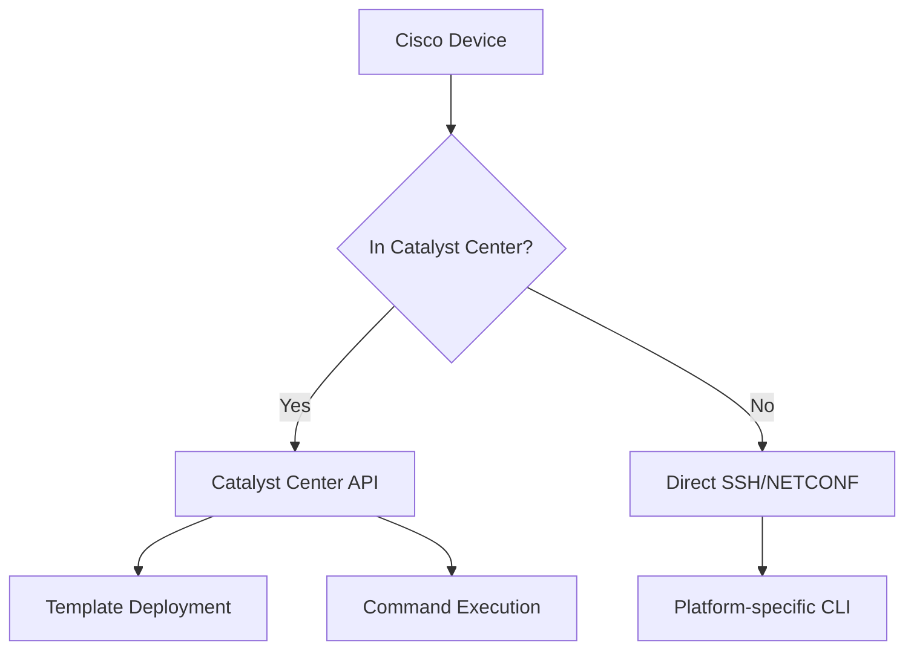
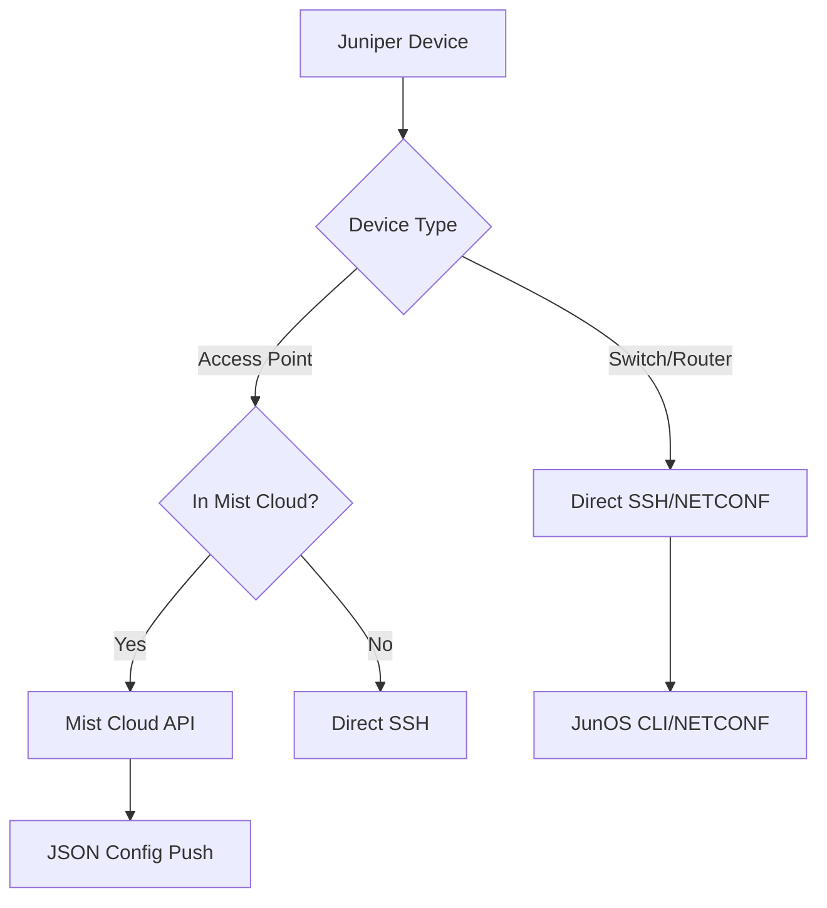
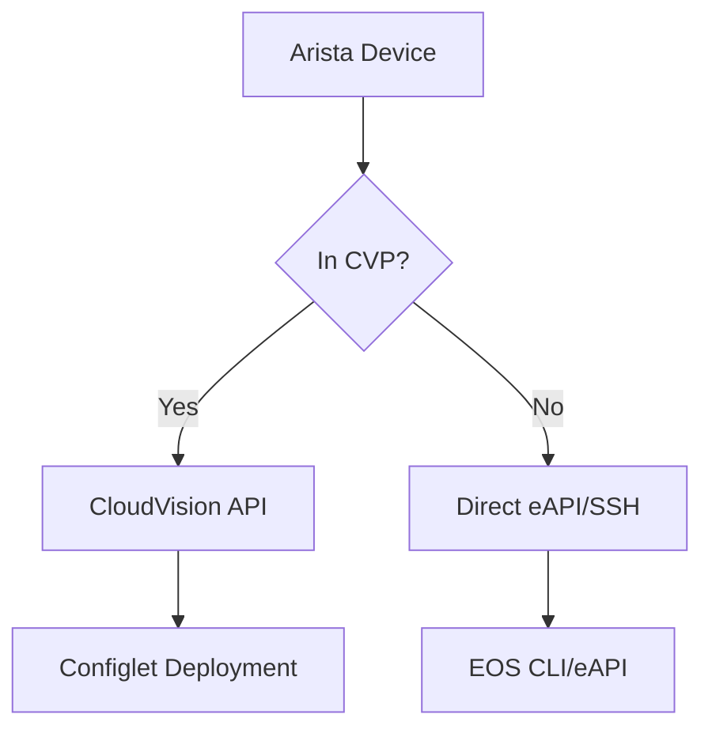

# Centralized API Management System

## 🎯 Overview

The Centralized API Management System automatically determines the optimal connection method for each network device, preferring centralized management APIs (like Cisco Catalyst Center, Juniper Mist Cloud, Arista CVP) when available, and falling back to direct device connections when needed.

## 🏗️ Architecture

### Core Components

1. **API Manager** (`services/api_manager.py`)
   - Manages all external API endpoint configurations
   - Determines optimal connection method per device
   - Retrieves device IPs from NetBox dynamically
   - Handles platform-specific credential management

2. **Device Connector** (`services/device_connector.py`)
   - Implements connection handlers for each API type
   - Provides unified interface for device operations
   - Handles connection failures and fallback scenarios

3. **NetBox Integration**
   - Single source of truth for device inventory
   - Dynamic IP address resolution
   - Platform and manufacturer detection
   - Credential management via secrets

## 🔗 Supported API Endpoints

### Cisco Ecosystem
- **Catalyst Center (DNA Center)** - Complete Cisco device management
- **Direct SSH/NETCONF** - Fallback for non-managed devices

### Juniper Ecosystem  
- **Mist Cloud** - Wireless access points and switches
- **Juniper Space** - Legacy device management
- **Direct SSH/NETCONF** - JunOS device fallback

### Arista Ecosystem
- **CloudVision Portal (CVP)** - Centralized Arista management
- **Direct SSH/API** - Individual device management

### Multi-Vendor Support
- **FortiManager** - Fortinet centralized management
- **Panorama** - Palo Alto centralized firewall management
- **Direct SSH** - Universal fallback for any vendor

## ⚙️ Configuration

### Environment Variables (.env)

```bash
# Cisco Catalyst Center
export CATALYST_CENTER_URL=https://catalyst-center.company.com
export CATALYST_CENTER_USERNAME=api-user
export CATALYST_CENTER_PASSWORD=secure-password

# Juniper Mist Cloud
export MIST_CLOUD_TOKEN=your-mist-api-token
export MIST_ORG_ID=your-organization-id

# Arista CloudVision Portal
export ARISTA_CVP_URL=https://cvp.company.com
export ARISTA_CVP_USERNAME=cvp-user
export ARISTA_CVP_PASSWORD=cvp-password

# Default device credentials (by platform)
export CISCO_DEFAULT_USERNAME=admin
export CISCO_DEFAULT_PASSWORD=admin
export JUNIPER_USERNAME=admin
export JUNIPER_PASSWORD=juniper123
```

### NetBox Requirements

The system relies on NetBox for:

1. **Device Inventory**
   ```python
   # Device must have:
   {
       "id": "device-uuid",
       "name": "device-hostname", 
       "primary_ip4": {"address": "192.168.1.10/24"},
       "platform": {"slug": "ios"},
       "device_type": {"manufacturer": {"slug": "cisco"}},
       "site": {"name": "datacenter-1"}
   }
   ```

2. **Custom Fields** (Optional)
   - `managed_by_catalyst_center`: Boolean
   - `mist_device_id`: String
   - `cvp_container`: String

3. **Secrets** (Optional)
   - Device-specific credentials
   - Platform default credentials

## 🚀 Usage Examples

### Workflow Integration

```python
from services.api_manager import get_device_connection
from services.device_connector import connect_to_device, deploy_device_configuration

# Get optimal connection method
connection_info = get_device_connection(device_id)
print(f"Will connect via: {connection_info['connection_method']}")
print(f"Device IP: {connection_info['device_ip']}")

# Deploy configuration using optimal method
result = await deploy_device_configuration(
    device_id=device_id,
    config=bgp_configuration,
    backup_before_change=True
)

if result.success:
    print(f"Deployed via {result.method}: {result.message}")
else:
    print(f"Deployment failed: {result.message}")
```

### Testing Connectivity

```python
from services.device_connector import device_connection_manager

# Test all available connection methods
connectivity_tests = await device_connection_manager.test_device_connectivity(device_id)

for method, result in connectivity_tests.items():
    print(f"{method}: {'✅' if result['success'] else '❌'} {result.get('message', '')}")
```

## 🔄 Connection Decision Logic

The system uses the following priority order:

1. **Check NetBox Device Info**
   - Get manufacturer, platform, device role
   - Retrieve management IP address
   - Look up custom fields for API associations

2. **Determine Centralized Management**
   - Cisco devices → Check Catalyst Center availability
   - Juniper APs → Check Mist Cloud availability  
   - Arista devices → Check CVP availability
   - Fortinet devices → Check FortiManager availability
   - Palo Alto devices → Check Panorama availability

3. **Fallback to Direct Connection**
   - SSH connection using device IP from NetBox
   - Platform-specific or device-specific credentials
   - NETCONF if supported by platform

## 📊 Connection Methods by Vendor

### Cisco Devices



### Juniper Devices



### Arista Devices



## 🛠️ Advanced Features

### Batch Operations

```python
# Deploy to multiple devices with different connection methods
deployment_tasks = []
for device_id in device_list:
    task = deploy_device_configuration(device_id, config)
    deployment_tasks.append(task)

# Execute with rate limiting
results = await execute_with_rate_limit(deployment_tasks, max_concurrent=5)
```

### Configuration Validation

```python
# Validate configuration after deployment
validation_result = await execute_device_command(
    device_id=device_id,
    command=get_validation_command(platform, config_type)
)

if validation_result.success:
    print(f"Validation passed: {validation_result.data['output']}")
```

### Error Handling and Fallback

```python
# Automatic fallback if centralized API fails
result = await deploy_device_configuration(device_id, config)

if not result.success and result.method == "catalyst_center":
    # Try direct SSH fallback
    fallback_result = await deploy_via_ssh(device_id, config)
    if fallback_result.success:
        print("Deployed via SSH fallback")
```

## 📈 Benefits

### Operational Benefits
- **Reduced Manual Configuration**: Device IPs automatically resolved from NetBox
- **Optimal Connection Method**: Always uses the most efficient management channel
- **Centralized Credential Management**: Platform defaults with device-specific overrides
- **Automatic Fallback**: Direct connection if centralized APIs unavailable

### Technical Benefits
- **Platform Agnostic**: Same workflow works across all vendors
- **Scalable**: Concurrent operations with rate limiting
- **Resilient**: Multiple connection methods with fallback
- **Observable**: Comprehensive logging of connection methods and results

### Management Benefits
- **Single Configuration Point**: All API endpoints configured in one place
- **Inventory Synchronization**: NetBox as single source of truth
- **Audit Trail**: Complete record of connection methods used
- **Cost Optimization**: Leverage existing centralized management investments

## 🔧 Troubleshooting

### Common Issues

1. **Device IP Not Found**
   ```
   Error: Device management IP not available
   Solution: Ensure device has primary_ip4 set in NetBox
   ```

2. **API Endpoint Unreachable**
   ```
   Error: Catalyst Center connection failed
   Solution: Check CATALYST_CENTER_URL and network connectivity
   ```

3. **Authentication Failed**
   ```
   Error: SSH authentication failed
   Solution: Verify credentials in NetBox secrets or environment variables
   ```

4. **Platform Not Supported**
   ```
   Error: Unknown platform 'custom-os'
   Solution: Add platform mapping in api_manager.py
   ```

### Debug Mode

```bash
# Enable debug logging
export LOG_LEVEL=DEBUG
export ENABLE_API_LOGGING=true

# Check endpoint status
python -c "from services.api_manager import api_manager; print(api_manager.list_available_endpoints())"
```

## 🔮 Future Enhancements

### Planned Features
- **Machine Learning**: Optimal connection method prediction
- **Health Monitoring**: Proactive API endpoint health checking  
- **Configuration Drift**: Continuous compliance monitoring
- **Intent Translation**: High-level intent to platform-specific config

### Integration Roadmap
- **HPE Aruba Central** - Aruba device management
- **Extreme ExtremeCloud IQ** - Extreme Networks management
- **Ruckus Cloud** - CommScope Ruckus wireless management
- **VMware VeloCloud** - SD-WAN orchestration

This centralized API management system transforms the network orchestrator from a device-centric to a service-centric approach, automatically handling the complexity of multi-vendor environments while leveraging the best management tools available for each platform.
