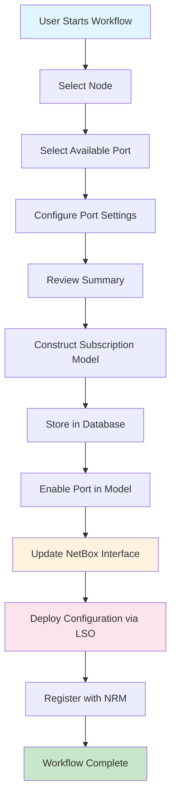

# Create Port Workflow - Technical Analysis

## 📋 Overview
The Create Port workflow is a comprehensive network port provisioning system that integrates inventory management (NetBox), workflow orchestration (Orchestrator), and device configuration (Ansible/LSO) into a seamless automated process.

**Purpose**: Provision a physical network port on a device with complete configuration management  
**Integration Points**: NetBox DCIM, Orchestrator Database, LSO/Ansible, NRM System  
**User Access**: Enhanced Dashboard UI at http://localhost:3000/dashboard.html

## 🔄 Data Flow Architecture

```
┌─────────────────┐    ┌──────────────┐    ┌─────────────────┐
│   Web UI Form   │◄──►│ Orchestrator │◄──►│   NetBox DCIM   │
│  (Port 3000)    │    │  (Port 8080) │    │   (Port 8000)   │
└─────────────────┘    └──────────────┘    └─────────────────┘
                              │
                              ▼
                       ┌──────────────┐    ┌─────────────────┐
                       │  Database    │    │      LSO        │
                       │ (PostgreSQL) │    │   (Ansible)     │
                       └──────────────┘    └─────────────────┘
                                                  │
                                                  ▼
                                           ┌─────────────────┐
                                           │  Network Device │
                                           │  Configuration  │
                                           └─────────────────┘
```

## 🚀 Complete Data Flow Process

### **High-Level Flow:**
```
[User Input] → [Form Validation] → [NetBox Integration] → [Subscription Model] → [Database Storage] → [Configuration Deployment] → [NRM Registration]
```

---

## 📝 Step-by-Step Technical Analysis

### 1. **Initial Input Form Generation** 
**File**: `workflows/port/create_port.py` → `initial_input_form_generator()`

#### **Data Sources:**
- **Database Query**: Active Node subscriptions from orchestrator database
- **Product Configuration**: Port speed from product definition  
- **NetBox API**: Available interfaces/ports from NetBox DCIM

#### **Form Steps:**
```python
# Step 1: Node Selection Form
class SelectNodeForm(FormPage):
    node_subscription_id: NodeChoice  # Populated from active subscriptions

# Step 2: Port Configuration Form  
class CreatePortForm(FormPage):
    port_ims_id: FreePortChoice      # NetBox interface ID (filtered)
    port_description: str            # User-provided description
    port_mode: PortModeChoice        # TAGGED, UNTAGGED, or LINK_MEMBER
    auto_negotiation: bool           # Enable/disable auto-negotiation  
    lldp: bool                       # Enable/disable LLDP protocol
```

#### **Data Validation & Filtering:**
- **Node Selector**: `workflows/shared.py → node_selector()`
  ```python
  # Queries database for active Node subscriptions
  node_subscriptions = subscriptions_by_product_type("Node", [SubscriptionLifecycle.ACTIVE])
  ```

- **Port Selector**: `workflows/shared.py → free_port_selector()`
  ```python
  # Calls NetBox API to find available interfaces
  interfaces = netbox.get_interfaces(
      device=node.node.node_name,
      speed=speed * 1000,  # Convert Mbps to bps
      enabled=False        # Only available ports
  )
  ```

**Data Origin**: 
- Nodes: Orchestrator database (existing active subscriptions)
- Ports: NetBox DCIM API (physical interface inventory)
- Product Speed: Product definition fixed input value

---

### 2. **Subscription Model Construction**
**File**: `workflows/port/create_port.py` → `construct_port_model()`

#### **Data Sources:**
- **User Input**: From form submission
- **NetBox API**: Interface details via `services/netbox.py → get_interface(id=port_ims_id)`
- **Database**: Node subscription data  
- **Product Definition**: Speed configuration

#### **Model Creation Process:**
```python
# 1. Create inactive subscription
subscription = PortInactive.from_product_id(
    product_id=product,
    customer_id=str(uuid.uuid4()),  # Generated UUID
    status=SubscriptionLifecycle.INITIAL
)

# 2. Get interface details from NetBox
interface = netbox.get_interface(id=port_ims_id)

# 3. Populate port data from NetBox
subscription.port.port_name = interface.name       # e.g., "GigabitEthernet0/0/1"
subscription.port.port_type = interface.type.value # e.g., "1000base-t"
subscription.port.ims_id = port_ims_id             # NetBox interface ID

# 4. Populate user configuration
subscription.port.port_description = port_description
subscription.port.port_mode = port_mode
subscription.port.auto_negotiation = auto_negotiation
subscription.port.lldp = lldp
subscription.port.enabled = False  # Initially disabled

# 5. Link to parent node
node = Node.from_subscription(node_subscription_id)
subscription.port.node = node.node

# 6. Convert to provisioning state
subscription = PortProvisioning.from_other_lifecycle(
    subscription, SubscriptionLifecycle.PROVISIONING
)
```

**Data Flow**:
- **IN**: User form data + NetBox interface details + Node subscription
- **OUT**: Complete PortProvisioning subscription model
- **Storage**: Orchestrator database (subscription and resource tables)

---

### 3. **Database Storage**
**Function**: `orchestrator.workflows.steps.store_process_subscription(Target.CREATE)`

#### **Data Destination:**
- **Orchestrator Database Tables**:
  - `subscriptions`: Main subscription record
  - `subscription_instances`: Resource instance relationships  
  - `subscription_instance_values`: Individual resource values
  - `processes`: Workflow execution tracking

**Purpose**: Persist complete subscription model for workflow state management

---

### 4. **Port Enablement** 
**File**: `workflows/port/create_port.py` → `enable_port()`

#### **Data Modification:**
```python
subscription.port.enabled = True  # Mark port as enabled in model
```

**Purpose**: Transition from disabled (available) to enabled (in-use) state

---

### 5. **IMS Update (NetBox Integration)**
**File**: `workflows/port/shared/steps.py` → `update_port_in_ims()`

#### **Data Flow:**
- **Source**: Current subscription model
- **Processing**: `products/services/netbox/netbox.py → build_payload()` creates NetBox-compatible payload
- **Destination**: NetBox DCIM via `services/netbox.py → update(payload, id=subscription.port.ims_id)`

#### **NetBox Update Payload Structure:**
```python
# From products/services/netbox/payload/port.py
InterfacePayload = {
    "device": int,                    # NetBox device ID
    "name": str,                      # Interface name (e.g., "GigE0/0/1")
    "type": str,                      # Interface type (e.g., "1000base-t")  
    "enabled": bool,                  # Administrative status
    "mode": str,                      # VLAN mode ("tagged"/"untagged")
    "description": str,               # User-provided description
    "tagged_vlans": List[int],        # VLAN assignments (populated by SAP)
    "speed": int,                     # Interface speed in bps
}
```

**API Call**:
```python
# services/netbox.py
netbox.update(payload, id=subscription.port.ims_id)
# Calls: PUT http://localhost:8000/api/dcim/interfaces/{id}/
```

**Data Purpose**: Update NetBox inventory to reflect port provisioning and configuration

---

### 6. **Configuration Deployment (LSO Integration)**
**File**: `workflows/port/create_port.py` → `provision_port()`

#### **Data Flow:**
- **Source**: Complete subscription model
- **Processing**: Convert subscription to JSON for Ansible consumption
- **Destination**: LSO (Local Service Orchestrator) via `services/lso_client.py`

#### **LSO Integration Details:**
```python
# Data preparation
extra_vars = {
    "port": json.loads(json_dumps(subscription))  # Full port config as JSON
}

# LSO execution call
execute_playbook(
    playbook_name="create_port.yaml",                    # Ansible playbook file
    callback_route=callback_route,                       # Workflow callback URL  
    inventory=f"{subscription.port.node.node_name}\n",   # Target device hostname/IP
    extra_vars=extra_vars                                # Port configuration data
)
```

#### **Ansible Playbook Receives:**
- **Target Device**: Node hostname/IP from inventory
- **Port Configuration JSON**:
  ```json
  {
    "port": {
      "port_name": "GigabitEthernet0/0/1",
      "port_type": "1000base-t", 
      "port_description": "User provided description",
      "port_mode": "tagged",
      "auto_negotiation": true,
      "lldp": true,
      "enabled": true,
      "node": {
        "node_name": "switch01.example.com",
        "management_ip": "192.168.1.10"
      },
      "ims_id": 12345,
      "nrm_id": null
    }
  }
  ```

#### **Device Configuration Applied:**
- Interface administrative status (shutdown/no shutdown)
- Speed and duplex settings
- VLAN mode configuration  
- LLDP protocol settings
- Auto-negotiation configuration
- Interface description

**LSO Communication Flow**:
```
Orchestrator → LSO HTTP API → Ansible Playbook → SSH/NETCONF → Network Device
```

---

### 7. **NRM Registration**
**File**: `workflows/port/create_port.py` → `provision_port_in_nrm()`

#### **Data Generation:**
```python
subscription.port.nrm_id = randrange(2**16)  # Random NRM ID (placeholder)
```

#### **Purpose:**
- **NRM**: Network Resource Manager ID for external system tracking
- **Current State**: Mock implementation with random ID  
- **Production Intent**: Integration with actual NRM system for resource lifecycle management

**Data Flow**: Internal model update (no external API calls in current implementation)

---

## 📊 Complete Data Sources & Destinations

### **Input Data Sources:**

#### **1. User Interface (Port 3000)**
- **Form Input**: User-provided configuration parameters
- **Validation**: Real-time form validation and selection constraints

#### **2. Orchestrator Database (PostgreSQL)**
- **Active Subscriptions**: Available nodes for port creation
- **Product Definitions**: Technical specifications and constraints
- **Workflow State**: Process execution and history

#### **3. NetBox DCIM (Port 8000)**
- **Device Inventory**: Physical devices and their interfaces
- **Interface Details**: Types, speeds, current configuration  
- **Availability Status**: Which interfaces are free for provisioning

### **Output Data Destinations:**

#### **1. Orchestrator Database (PostgreSQL)**
- **Subscription Model**: Complete port configuration and lifecycle
- **Resource Relationships**: Port-to-node associations
- **Workflow State**: Execution progress and results

#### **2. NetBox DCIM (Port 8000)**
- **Interface Configuration**: Administrative status, description, VLAN mode
- **Resource Allocation**: Mark interface as in-use
- **Inventory Updates**: Reflect provisioned state

#### **3. LSO/Ansible System**
- **Device Configuration**: Physical interface settings via SSH/NETCONF
- **Protocol Configuration**: LLDP, auto-negotiation, speed/duplex
- **Administrative State**: Interface enable/disable

#### **4. NRM System (Future)**
- **Resource Registration**: External system tracking ID
- **Lifecycle Management**: Resource state and ownership

---

## 🔧 Technical Implementation Files

### **Core Workflow Files:**
- `workflows/port/create_port.py` - Main workflow definition
- `workflows/port/shared/forms.py` - Form validation and choices
- `workflows/port/shared/steps.py` - Shared workflow steps

### **Product Model Files:**
- `products/product_types/port.py` - Port subscription model definitions
- `products/product_blocks/port.py` - Port resource block models
- `products/services/netbox/payload/port.py` - NetBox payload construction

### **Service Integration Files:**  
- `services/netbox.py` - NetBox API client and data models
- `services/lso_client.py` - LSO/Ansible integration client
- `workflows/shared.py` - Shared selectors and utilities

### **Database Schema:**
- Subscription tables for model persistence
- Resource instance relationships
- Workflow execution tracking

---

## 🛡️ Error Handling & Validation

### **Validation Points:**
1. **Form Validation**: User input constraints and format validation
2. **Database Constraints**: Referential integrity and business rules
3. **NetBox API**: Connectivity and data validation  
4. **Port Availability**: Real-time interface availability checking
5. **Ansible Execution**: Playbook success/failure monitoring

### **Error Recovery:**
- **Database Transactions**: Automatic rollback on failure
- **NetBox Reversion**: Configuration cleanup on workflow failure  
- **Device Configuration**: Ansible-based rollback procedures
- **Workflow State**: Process resumption and manual intervention points

### **Monitoring & Logging:**
- Workflow execution progress tracking
- API call success/failure logging
- Device configuration deployment status
- Error notification and alerting

---

## 🚀 Workflow Execution Flow



## 📱 User Experience Integration

### **Enhanced Dashboard Access:**
- **Quick Action**: "Import Device Types" → "Network Operations" → "Port Management"
- **Workflow Categories**: Organized under "Network Operations" section
- **Status Monitoring**: Real-time workflow progress tracking
- **Error Reporting**: User-friendly error messages and resolution guidance

### **Mobile Responsive:**
- Touch-optimized form inputs
- Responsive layout for all device sizes  
- Optimized workflow navigation

---

## 🔍 Troubleshooting Guide

### **Common Issues:**

#### **1. No Available Ports**
- **Cause**: All interfaces on selected node are already provisioned
- **Solution**: Check NetBox for interface status, or select different node

#### **2. NetBox Connection Errors**  
- **Cause**: NetBox API unavailable or incorrect credentials
- **Solution**: Verify NetBox service status and API token configuration

#### **3. Ansible Deployment Failures**
- **Cause**: Device SSH/NETCONF connectivity issues
- **Solution**: Check network connectivity and device credentials  

#### **4. Database Constraint Violations**
- **Cause**: Data integrity issues or concurrent modifications
- **Solution**: Check for conflicting subscriptions and retry workflow

### **Debug Commands:**
```bash
# Check NetBox connectivity
curl -H "Authorization: Token YOUR_TOKEN" http://localhost:8000/api/dcim/interfaces/

# Check orchestrator API
curl http://localhost:8080/api/workflows/

# View workflow logs
docker logs orchestrator

# Check database state
docker exec -it postgres psql -U orchestrator -d orchestrator
```

---

## 🎯 Future Enhancements

### **Planned Improvements:**
1. **Real NRM Integration**: Replace mock NRM ID with actual system integration
2. **Enhanced Validation**: Real-time device connectivity validation
3. **Batch Operations**: Multiple port provisioning in single workflow
4. **Configuration Templates**: Pre-defined port configuration profiles
5. **Automated Testing**: Integration test suite for end-to-end validation

### **Integration Opportunities:**
- **Monitoring Systems**: Integration with network monitoring platforms
- **Change Management**: Integration with ITSM systems for change tracking
- **Compliance**: Automated compliance checking and reporting
- **Analytics**: Port utilization and performance analytics

---

## 📚 Related Documentation

- **[Enhanced UI Guide](../ENHANCED_UI_GUIDE.md)** - Complete dashboard documentation
- **[API Documentation](../API_DOCUMENTATION.md)** - REST API reference
- **[NetBox Integration Guide](../README.md#netbox-operations)** - NetBox setup and usage
- **[Workflow Development Guide](../CONTRIBUTING.md)** - Creating custom workflows

---

**💡 Key Takeaway**: The Create Port Workflow demonstrates a complete Intent-Based Networking approach, where high-level user intent (provision a port) is automatically translated into detailed technical implementation across multiple systems (inventory, orchestration, and device configuration).
