# System Architecture - Level 1

```mermaid
graph TB
    subgraph "External Systems"
        USER[👤 Network Engineer]
        GIT[📦 Git Repository<br/>Device Types]
        NETBOX[🏢 NetBox Instance]
    end
    
    subgraph "IBN Orchestrator Platform"
        API[🌐 FastAPI Gateway]
        WORKFLOW[⚙️ Workflow Engine]
        SCHEDULER[📅 Task Scheduler]
        DB[(🗃️ PostgreSQL Database)]
        REDIS[(🔴 Redis Cache)]
    end
    
    subgraph "Infrastructure Layer"
        DOCKER[🐳 Docker Containers]
        NETWORK[🔗 Container Network]
        VOLUMES[💾 Persistent Volumes]
    end
    
    %% User Interactions
    USER -->|Submit Workflow| API
    USER -->|Monitor Status| API
    
    %% External Data Sources
    GIT -->|Device Type Definitions| WORKFLOW
    WORKFLOW -->|Create/Update Objects| NETBOX
    
    %% Internal Flow
    API -->|Queue Tasks| WORKFLOW
    WORKFLOW -->|Store State| DB
    WORKFLOW -->|Cache Results| REDIS
    SCHEDULER -->|Trigger Workflows| WORKFLOW
    
    %% Infrastructure
    DOCKER -->|Host Services| API
    DOCKER -->|Host Services| WORKFLOW
    DOCKER -->|Host Services| SCHEDULER
    NETWORK -->|Inter-service Communication| DOCKER
    VOLUMES -->|Data Persistence| DB
    VOLUMES -->|Data Persistence| REDIS
    
    %% Styling
    classDef userClass fill:#e1f5fe
    classDef externalClass fill:#f3e5f5
    classDef serviceClass fill:#e8f5e8
    classDef dataClass fill:#fff3e0
    classDef infraClass fill:#fafafa
    
    class USER userClass
    class GIT,NETBOX externalClass
    class API,WORKFLOW,SCHEDULER serviceClass
    class DB,REDIS dataClass
    class DOCKER,NETWORK,VOLUMES infraClass
```

## Key Components

- **IBN Orchestrator Platform**: Core system providing workflow automation
- **External Integrations**: NetBox DCIM and Git-based device libraries
- **Infrastructure Layer**: Containerized deployment with persistent storage
- **User Interface**: RESTful API for workflow submission and monitoring
