# Component Architecture - Level 2

```mermaid
graph TB
    subgraph "API Gateway Layer"
        FASTAPI[🌐 FastAPI Server]
        AUTH[🔐 Authentication]
        VALID[✅ Request Validation]
        RATE[⏱️ Rate Limiting]
    end
    
    subgraph "Workflow Engine"
        ORCHESTRATOR[⚙️ Workflow Orchestrator]
        TASKQUEUE[📋 Task Queue]
        EXECUTOR[🚀 Task Executor]
        STATE[📊 State Manager]
    end
    
    subgraph "Task Management"
        SCHEDULER[📅 Cron Scheduler]
        MONITOR[👀 Health Monitor]
        RETRY[🔄 Retry Handler]
        LOGGER[📝 Audit Logger]
    end
    
    subgraph "Data Processing"
        PARSER[📄 YAML Parser]
        VALIDATOR[🔍 Schema Validator]
        TRANSFORMER[🔄 Data Transformer]
        MAPPER[🗺️ Object Mapper]
    end
    
    subgraph "External Connectors"
        NETBOX_CLIENT[📡 NetBox API Client]
        GIT_CLIENT[📦 Git Client]
        WEBHOOK[🔗 Webhook Handler]
    end
    
    subgraph "Storage Layer"
        POSTGRES[(🗃️ PostgreSQL)]
        REDIS[(🔴 Redis)]
        FILESYSTEM[📁 File System]
    end
    
    %% API Flow
    FASTAPI --> AUTH
    AUTH --> VALID
    VALID --> RATE
    RATE --> ORCHESTRATOR
    
    %% Workflow Processing
    ORCHESTRATOR --> TASKQUEUE
    TASKQUEUE --> EXECUTOR
    EXECUTOR --> STATE
    STATE --> POSTGRES
    
    %% Task Management
    SCHEDULER --> ORCHESTRATOR
    MONITOR --> EXECUTOR
    RETRY --> EXECUTOR
    LOGGER --> POSTGRES
    
    %% Data Processing Pipeline
    EXECUTOR --> PARSER
    PARSER --> VALIDATOR
    VALIDATOR --> TRANSFORMER
    TRANSFORMER --> MAPPER
    
    %% External Integration
    MAPPER --> NETBOX_CLIENT
    EXECUTOR --> GIT_CLIENT
    NETBOX_CLIENT --> WEBHOOK
    
    %% Caching and Storage
    ORCHESTRATOR --> REDIS
    STATE --> REDIS
    GIT_CLIENT --> FILESYSTEM
    
    %% Styling
    classDef apiClass fill:#e3f2fd
    classDef workflowClass fill:#e8f5e8
    classDef taskClass fill:#fff3e0
    classDef dataClass fill:#f3e5f5
    classDef connectorClass fill:#fce4ec
    classDef storageClass fill:#f1f8e9
    
    class FASTAPI,AUTH,VALID,RATE apiClass
    class ORCHESTRATOR,TASKQUEUE,EXECUTOR,STATE workflowClass
    class SCHEDULER,MONITOR,RETRY,LOGGER taskClass
    class PARSER,VALIDATOR,TRANSFORMER,MAPPER dataClass
    class NETBOX_CLIENT,GIT_CLIENT,WEBHOOK connectorClass
    class POSTGRES,REDIS,FILESYSTEM storageClass
```

## Component Responsibilities

### API Gateway Layer
- **FastAPI Server**: HTTP request handling and routing
- **Authentication**: JWT token validation and user authorization
- **Request Validation**: Pydantic model validation
- **Rate Limiting**: Request throttling and abuse prevention

### Workflow Engine
- **Workflow Orchestrator**: Main coordination logic
- **Task Queue**: Asynchronous task management
- **Task Executor**: Individual task processing
- **State Manager**: Workflow state persistence

### Task Management
- **Cron Scheduler**: Time-based workflow triggers
- **Health Monitor**: System health checks
- **Retry Handler**: Failed task recovery
- **Audit Logger**: Comprehensive operation logging

### Data Processing
- **YAML Parser**: Device type definition parsing
- **Schema Validator**: YAML structure validation
- **Data Transformer**: Format conversion and normalization
- **Object Mapper**: NetBox object mapping

### External Connectors
- **NetBox API Client**: REST API communication
- **Git Client**: Repository synchronization
- **Webhook Handler**: Event notifications
