# Vendor Import Workflow

```mermaid
flowchart TD
    START([🚀 Start Import Workflow])
    
    FORM_DISPLAY[📋 Display Vendor Selection Form]
    VENDOR_SELECT{🏢 Select Vendors?}
    SELECT_ALL[📦 Select All Vendors]
    SELECT_SPECIFIC[🎯 Select Specific Vendors]
    
    VALIDATE_FORM[✅ Validate Form Data]
    FORM_VALID{📝 Form Valid?}
    FORM_ERROR[❌ Show Form Errors]
    
    GIT_CLONE[📦 Clone Device Library]
    GIT_SUCCESS{📥 Clone Success?}
    GIT_ERROR[❌ Git Clone Failed]
    
    SCAN_VENDORS[🔍 Scan Vendor Directories]
    FILTER_VENDORS[🎯 Filter Selected Vendors]
    
    PROCESS_VENDOR[🏢 Process Vendor Directory]
    SCAN_DEVICES[📱 Scan Device Types]
    
    PARSE_YAML[📄 Parse YAML Definition]
    VALIDATE_YAML[✅ Validate Schema]
    YAML_VALID{📋 YAML Valid?}
    YAML_ERROR[❌ Log YAML Error]
    
    MAP_OBJECTS[🗺️ Map to NetBox Objects]
    CREATE_MANUFACTURER[🏭 Create Manufacturer]
    CREATE_DEVICE_TYPE[📱 Create Device Type]
    CREATE_MODULES[🔌 Create Module Types]
    
    NETBOX_SUCCESS{✅ NetBox Success?}
    NETBOX_ERROR[❌ Log NetBox Error]
    
    MORE_DEVICES{📱 More Devices?}
    MORE_VENDORS{🏢 More Vendors?}
    
    GENERATE_SUMMARY[📊 Generate Import Summary]
    END([✅ Workflow Complete])
    
    %% Main Flow
    START --> FORM_DISPLAY
    FORM_DISPLAY --> VENDOR_SELECT
    VENDOR_SELECT -->|All| SELECT_ALL
    VENDOR_SELECT -->|Specific| SELECT_SPECIFIC
    
    SELECT_ALL --> VALIDATE_FORM
    SELECT_SPECIFIC --> VALIDATE_FORM
    
    VALIDATE_FORM --> FORM_VALID
    FORM_VALID -->|No| FORM_ERROR
    FORM_ERROR --> FORM_DISPLAY
    FORM_VALID -->|Yes| GIT_CLONE
    
    GIT_CLONE --> GIT_SUCCESS
    GIT_SUCCESS -->|No| GIT_ERROR
    GIT_ERROR --> END
    GIT_SUCCESS -->|Yes| SCAN_VENDORS
    
    SCAN_VENDORS --> FILTER_VENDORS
    FILTER_VENDORS --> PROCESS_VENDOR
    
    %% Vendor Processing Loop
    PROCESS_VENDOR --> SCAN_DEVICES
    SCAN_DEVICES --> PARSE_YAML
    PARSE_YAML --> VALIDATE_YAML
    VALIDATE_YAML --> YAML_VALID
    
    YAML_VALID -->|No| YAML_ERROR
    YAML_ERROR --> MORE_DEVICES
    YAML_VALID -->|Yes| MAP_OBJECTS
    
    MAP_OBJECTS --> CREATE_MANUFACTURER
    CREATE_MANUFACTURER --> CREATE_DEVICE_TYPE
    CREATE_DEVICE_TYPE --> CREATE_MODULES
    CREATE_MODULES --> NETBOX_SUCCESS
    
    NETBOX_SUCCESS -->|No| NETBOX_ERROR
    NETBOX_ERROR --> MORE_DEVICES
    NETBOX_SUCCESS -->|Yes| MORE_DEVICES
    
    MORE_DEVICES -->|Yes| SCAN_DEVICES
    MORE_DEVICES -->|No| MORE_VENDORS
    
    MORE_VENDORS -->|Yes| PROCESS_VENDOR
    MORE_VENDORS -->|No| GENERATE_SUMMARY
    
    GENERATE_SUMMARY --> END
    
    %% Styling
    classDef startEndClass fill:#e8f5e8,stroke:#4caf50
    classDef processClass fill:#e3f2fd,stroke:#2196f3
    classDef decisionClass fill:#fff3e0,stroke:#ff9800
    classDef errorClass fill:#ffebee,stroke:#f44336
    classDef createClass fill:#f3e5f5,stroke:#9c27b0
    
    class START,END startEndClass
    class FORM_DISPLAY,VALIDATE_FORM,GIT_CLONE,SCAN_VENDORS,FILTER_VENDORS,PROCESS_VENDOR,SCAN_DEVICES,PARSE_YAML,VALIDATE_YAML,MAP_OBJECTS,GENERATE_SUMMARY processClass
    class VENDOR_SELECT,FORM_VALID,GIT_SUCCESS,YAML_VALID,NETBOX_SUCCESS,MORE_DEVICES,MORE_VENDORS decisionClass
    class FORM_ERROR,GIT_ERROR,YAML_ERROR,NETBOX_ERROR errorClass
    class SELECT_ALL,SELECT_SPECIFIC,CREATE_MANUFACTURER,CREATE_DEVICE_TYPE,CREATE_MODULES createClass
```

## Workflow Steps

### 1. Form Processing
- Display vendor selection form with multi-select capability
- Validate user input and handle form errors
- Support both "Select All" and specific vendor selection

### 2. Git Repository Management
- Clone the latest device-type library
- Handle git authentication and network errors
- Ensure local repository is up to date

### 3. Vendor Discovery & Filtering
- Scan vendor directories in the cloned repository
- Filter based on user selection criteria
- Process vendors in parallel where possible

### 4. Device Type Processing
- Parse YAML device definitions
- Validate against NetBox schema requirements
- Handle malformed or incomplete definitions

### 5. NetBox Object Creation
- Create manufacturer objects if they don't exist
- Create device types with full specifications
- Create associated module types and components

### 6. Error Handling & Reporting
- Comprehensive logging of all operations
- Graceful handling of API failures
- Detailed summary reporting with success/failure counts
