# Data Flow & Integration Architecture

```mermaid
graph TB
    subgraph "Data Sources"
        GIT_REPO[📦 Git Repository<br/>netbox-community/devicetype-library]
        USER_INPUT[👤 User Form Data<br/>Vendor Selection]
        CONFIG[⚙️ System Configuration<br/>NetBox Credentials]
    end
    
    subgraph "Ingestion Layer"
        GIT_SYNC[📥 Git Synchronization]
        FORM_PARSER[📋 Form Data Parser]
        CONFIG_LOADER[🔧 Config Loader]
    end
    
    subgraph "Processing Pipeline"
        YAML_PARSER[📄 YAML Parser]
        SCHEMA_VALIDATOR[✅ Schema Validator]
        DATA_TRANSFORMER[🔄 Data Transformer]
        OBJECT_MAPPER[🗺️ NetBox Object Mapper]
    end
    
    subgraph "Validation & Enrichment"
        BUSINESS_RULES[📏 Business Rule Engine]
        DUPLICATE_CHECK[🔍 Duplicate Detection]
        DATA_ENRICHMENT[✨ Data Enrichment]
        QUALITY_ASSURANCE[🎯 Quality Assurance]
    end
    
    subgraph "Output Layer"
        NETBOX_API[🌐 NetBox REST API]
        AUDIT_LOG[📝 Audit Logging]
        METRICS[📊 Metrics Collection]
        NOTIFICATIONS[🔔 Event Notifications]
    end
    
    subgraph "Storage Systems"
        WORKFLOW_STATE[(🗃️ Workflow State<br/>PostgreSQL)]
        CACHE_LAYER[(🔴 Result Cache<br/>Redis)]
        FILE_SYSTEM[📁 Temporary Files<br/>Local Storage]
    end
    
    %% Data Flow - Ingestion
    GIT_REPO --> GIT_SYNC
    USER_INPUT --> FORM_PARSER
    CONFIG --> CONFIG_LOADER
    
    %% Data Flow - Processing
    GIT_SYNC --> YAML_PARSER
    FORM_PARSER --> OBJECT_MAPPER
    CONFIG_LOADER --> NETBOX_API
    
    YAML_PARSER --> SCHEMA_VALIDATOR
    SCHEMA_VALIDATOR --> DATA_TRANSFORMER
    DATA_TRANSFORMER --> OBJECT_MAPPER
    
    %% Data Flow - Validation
    OBJECT_MAPPER --> BUSINESS_RULES
    BUSINESS_RULES --> DUPLICATE_CHECK
    DUPLICATE_CHECK --> DATA_ENRICHMENT
    DATA_ENRICHMENT --> QUALITY_ASSURANCE
    
    %% Data Flow - Output
    QUALITY_ASSURANCE --> NETBOX_API
    NETBOX_API --> AUDIT_LOG
    NETBOX_API --> METRICS
    NETBOX_API --> NOTIFICATIONS
    
    %% State Management
    FORM_PARSER --> WORKFLOW_STATE
    OBJECT_MAPPER --> WORKFLOW_STATE
    QUALITY_ASSURANCE --> WORKFLOW_STATE
    
    %% Caching
    YAML_PARSER --> CACHE_LAYER
    DUPLICATE_CHECK --> CACHE_LAYER
    NETBOX_API --> CACHE_LAYER
    
    %% File Operations
    GIT_SYNC --> FILE_SYSTEM
    YAML_PARSER --> FILE_SYSTEM
    
    %% Styling
    classDef sourceClass fill:#e8f5e8
    classDef ingestionClass fill:#e3f2fd
    classDef processingClass fill:#fff3e0
    classDef validationClass fill:#f3e5f5
    classDef outputClass fill:#fce4ec
    classDef storageClass fill:#f1f8e9
    
    class GIT_REPO,USER_INPUT,CONFIG sourceClass
    class GIT_SYNC,FORM_PARSER,CONFIG_LOADER ingestionClass
    class YAML_PARSER,SCHEMA_VALIDATOR,DATA_TRANSFORMER,OBJECT_MAPPER processingClass
    class BUSINESS_RULES,DUPLICATE_CHECK,DATA_ENRICHMENT,QUALITY_ASSURANCE validationClass
    class NETBOX_API,AUDIT_LOG,METRICS,NOTIFICATIONS outputClass
    class WORKFLOW_STATE,CACHE_LAYER,FILE_SYSTEM storageClass
```

## Data Flow Stages

### 1. Data Ingestion
- **Git Synchronization**: Clone/pull latest device definitions
- **Form Data Parsing**: Extract and validate user selections
- **Configuration Loading**: Load NetBox connection parameters

### 2. Processing Pipeline
- **YAML Parsing**: Convert device definitions to structured data
- **Schema Validation**: Ensure compliance with NetBox requirements
- **Data Transformation**: Normalize and standardize data formats
- **Object Mapping**: Map to NetBox data model

### 3. Validation & Enrichment
- **Business Rules**: Apply organizational policies and standards
- **Duplicate Detection**: Identify existing objects to prevent conflicts
- **Data Enrichment**: Add computed fields and relationships
- **Quality Assurance**: Final validation before API calls

### 4. Output & Storage
- **NetBox API**: Create objects via REST API
- **Audit Logging**: Track all operations for compliance
- **Metrics Collection**: Performance and success metrics
- **Event Notifications**: Webhook and status updates

## Integration Points

- **Horizontal Scaling**: Processing pipeline supports parallel execution
- **Error Recovery**: Each stage can retry independently
- **Caching Strategy**: Aggressive caching for performance optimization
- **State Persistence**: Complete workflow state maintained for recovery
