# Sequence Diagram - Workflow Execution

```mermaid
sequenceDiagram
    participant User as 👤 Network Engineer
    participant API as 🌐 FastAPI Gateway
    participant WF as ⚙️ Workflow Engine
    participant Git as 📦 Git Client
    participant Parser as 📄 YAML Parser
    participant Validator as ✅ Schema Validator
    participant NetBox as 🏢 NetBox API
    participant DB as 🗃️ Database
    participant Cache as 🔴 Redis Cache
    
    %% Workflow Initiation
    Note over User, Cache: Workflow Initiation Phase
    User->>+API: POST /workflows/import-vendors
    Note right of User: Form: selected_vendors=["Cisco", "Arista"]
    
    API->>+WF: Create workflow instance
    WF->>+DB: Store initial state
    DB-->>-WF: State ID: wf_12345
    WF-->>-API: Workflow ID: wf_12345
    API-->>-User: 202 Accepted {workflow_id: wf_12345}
    
    %% Background Processing Begins
    Note over User, Cache: Background Processing Phase
    WF->>+Git: Clone repository
    Note right of Git: git clone netbox-community/devicetype-library
    Git->>Git: Fetch latest device definitions
    Git-->>-WF: Repository cloned successfully
    
    WF->>+Cache: Check cached vendor list
    Cache-->>-WF: Cache miss - rebuild required
    
    %% Vendor Discovery
    Note over User, Cache: Vendor Discovery & Filtering
    WF->>WF: Scan vendor directories
    WF->>WF: Filter: Cisco, Arista
    
    loop For each selected vendor
        WF->>+Parser: Parse vendor directory
        Note right of Parser: Cisco/ -> [device1.yaml, device2.yaml, ...]
        
        loop For each device YAML
            Parser->>Parser: Read YAML file
            Parser->>+Validator: Validate device definition
            
            alt YAML is valid
                Validator-->>Parser: ✅ Valid schema
                Parser->>Parser: Add to processing queue
            else YAML is invalid
                Validator-->>Parser: ❌ Schema errors
                Parser->>DB: Log validation error
            end
        end
        
        Parser-->>-WF: Device definitions ready
    end
    
    %% NetBox Integration
    Note over User, Cache: NetBox Object Creation
    loop For each valid device definition
        WF->>+NetBox: Check if manufacturer exists
        
        alt Manufacturer exists
            NetBox-->>WF: ✅ Manufacturer found
        else Create new manufacturer
            WF->>NetBox: POST /api/dcim/manufacturers/
            NetBox-->>WF: ✅ Manufacturer created
        end
        
        WF->>NetBox: Check if device type exists
        
        alt Device type exists
            NetBox-->>WF: ✅ Device type found
            WF->>DB: Log: Device type skipped (exists)
        else Create new device type
            WF->>NetBox: POST /api/dcim/device-types/
            NetBox-->>-WF: ✅ Device type created
            
            %% Create related objects
            opt Has module bays
                WF->>+NetBox: POST /api/dcim/module-bay-templates/
                NetBox-->>-WF: ✅ Module bays created
            end
            
            opt Has power ports
                WF->>+NetBox: POST /api/dcim/power-port-templates/
                NetBox-->>-WF: ✅ Power ports created
            end
            
            opt Has interfaces
                WF->>+NetBox: POST /api/dcim/interface-templates/
                NetBox-->>-WF: ✅ Interfaces created
            end
        end
    end
    
    %% Workflow Completion
    Note over User, Cache: Completion & Reporting
    WF->>+Cache: Cache results for future use
    Cache-->>-WF: Results cached
    
    WF->>+DB: Update workflow state = COMPLETED
    WF->>DB: Store execution summary
    DB-->>-WF: State updated
    
    %% User Status Check
    User->>+API: GET /workflows/wf_12345/status
    API->>+DB: Retrieve workflow status
    DB-->>-API: Status: COMPLETED, Summary: {...}
    API-->>-User: 200 OK {status: "completed", summary: {...}}
    
    %% Optional Webhook Notification
    opt Webhooks configured
        WF->>User: Webhook: Workflow completed
    end
```

## Sequence Flow Explanation

### Phase 1: Initiation (Synchronous)
1. User submits vendor import request via API
2. Workflow engine creates new workflow instance
3. Initial state persisted to database
4. User receives workflow ID for tracking

### Phase 2: Processing (Asynchronous)
1. Git repository cloning and synchronization
2. Vendor directory scanning and filtering
3. YAML parsing and schema validation
4. Error logging for invalid definitions

### Phase 3: Integration (Batch Operations)
1. Manufacturer existence checks and creation
2. Device type existence checks and creation  
3. Related object creation (module bays, ports, interfaces)
4. Comprehensive error handling and recovery

### Phase 4: Completion (Finalization)
1. Result caching for performance optimization
2. Workflow state updates and summary generation
3. User notification via polling or webhooks
4. Audit trail completion

## Key Design Patterns

- **Asynchronous Processing**: Long-running operations don't block API
- **Idempotent Operations**: Safe to retry failed operations
- **Comprehensive Logging**: Full audit trail for troubleshooting
- **Caching Strategy**: Performance optimization for repeated operations
- **Graceful Degradation**: Partial success scenarios handled elegantly
