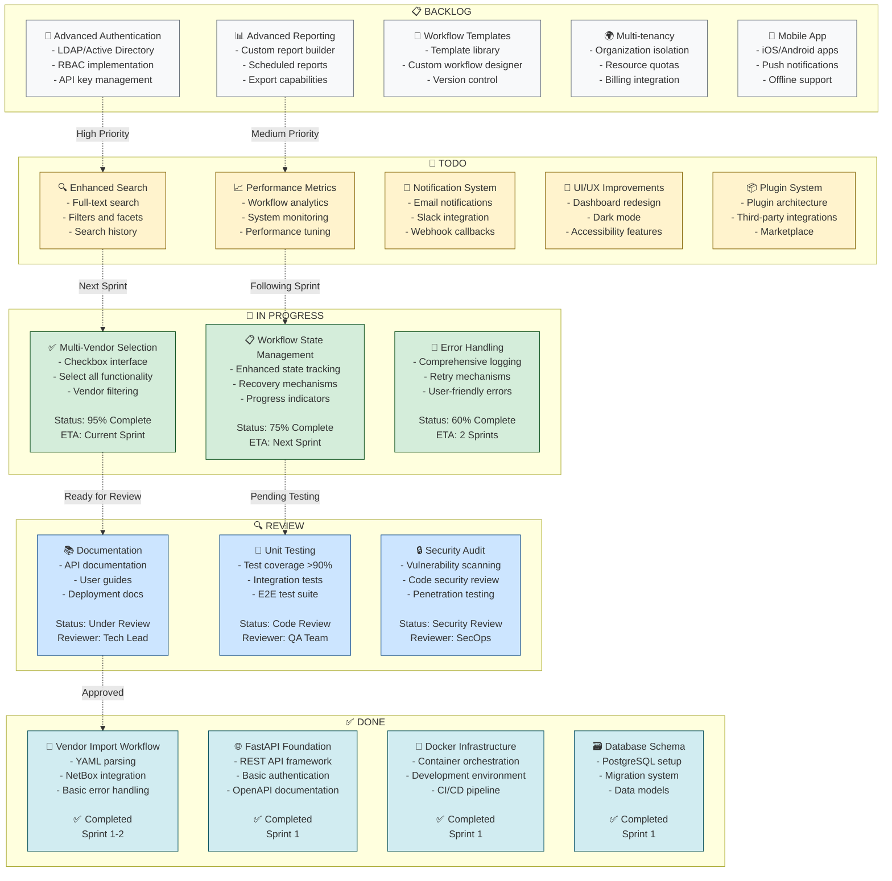

# Product Roadmap - Kanban Board

## Sprint Planning Overview

### Current Sprint (Sprint 3)
**Focus**: Core Workflow Enhancement & Stabilization
- **In Progress**: Multi-vendor selection (95% complete)
- **Priority**: Complete workflow state management
- **Target**: Production-ready vendor import capability

### Next Sprint (Sprint 4)
**Focus**: Quality & Documentation
- **Moving to Progress**: Enhanced error handling
- **Priority**: Complete documentation suite
- **Target**: Public API documentation release

### Sprint 5-6 (Medium Term)
**Focus**: User Experience & Performance
- **Planned**: Advanced search and filtering
- **Priority**: Performance optimization
- **Target**: Sub-second workflow initiation

## Key Milestones

### 🎯 Q1 2025 Goals
- ✅ Core vendor import functionality
- 🚧 Multi-vendor selection capability
- 📋 Comprehensive documentation
- 🔍 Security audit completion

### 🎯 Q2 2025 Goals
- 📊 Advanced reporting and analytics
- 🔔 Notification and webhook system
- 🎨 Enhanced user interface
- 📈 Performance monitoring

### 🎯 Q3 2025 Goals
- 🔐 Enterprise authentication
- 🔄 Workflow template system
- 📦 Plugin architecture
- 🌍 Multi-tenancy support

## Resource Allocation

- **Development**: 60% (3 developers)
- **QA/Testing**: 20% (1 QA engineer)
- **DevOps**: 15% (0.5 DevOps engineer)
- **Documentation**: 5% (Technical writer)

## Success Metrics

- **Velocity**: 25 story points per sprint
- **Quality**: <5% bug rate in production
- **Performance**: <2s average workflow initiation
- **Adoption**: 100+ active workflows per day
