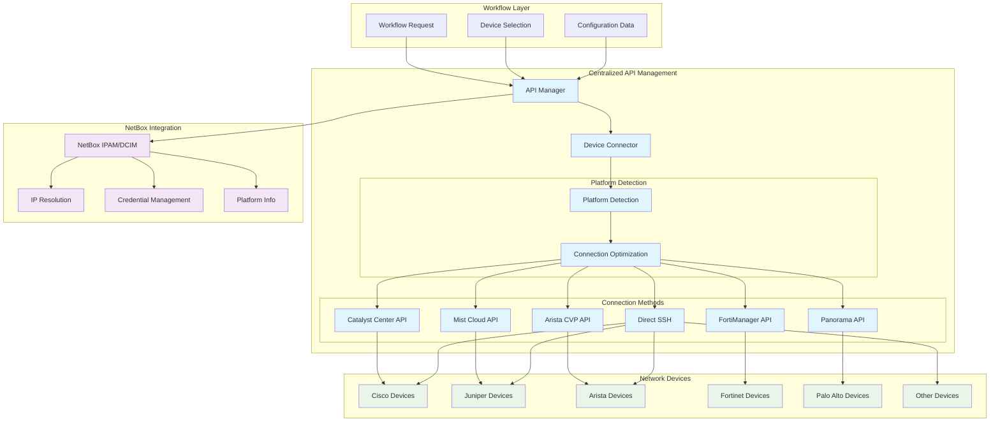
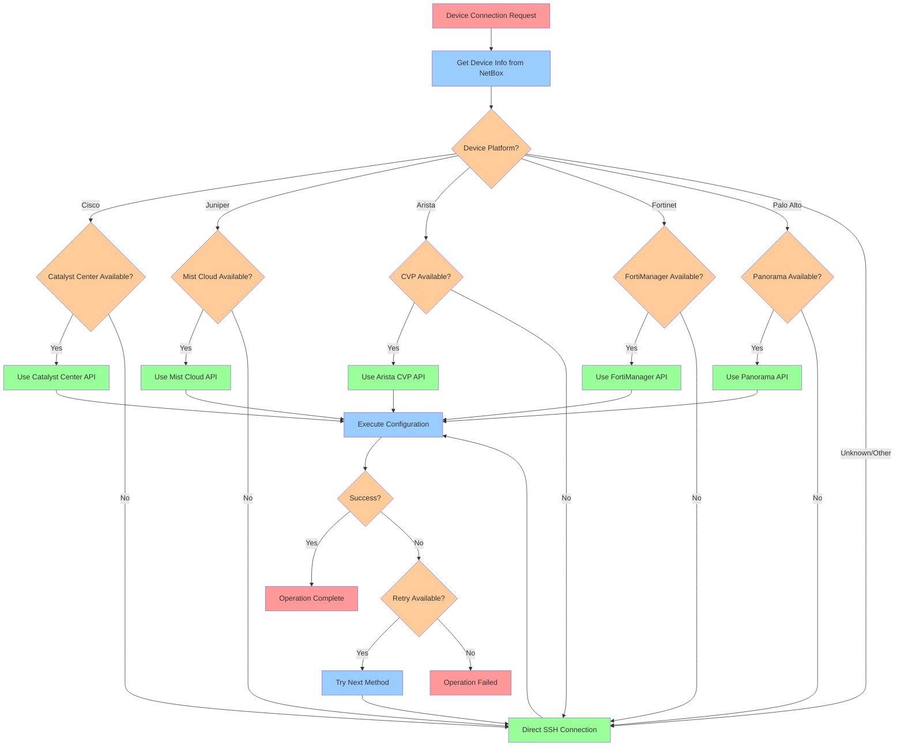
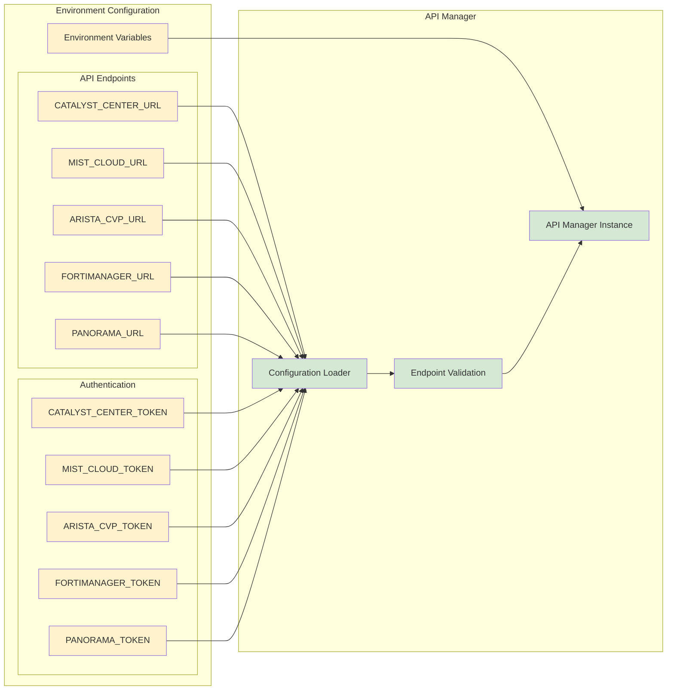

# Centralized API Management Flow Diagram

## Overview
This diagram shows the centralized API management architecture and flow for device connectivity optimization.

## Connection Priority Logic

## API Manager Configuration

