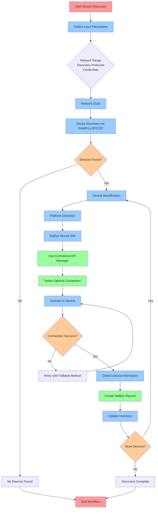
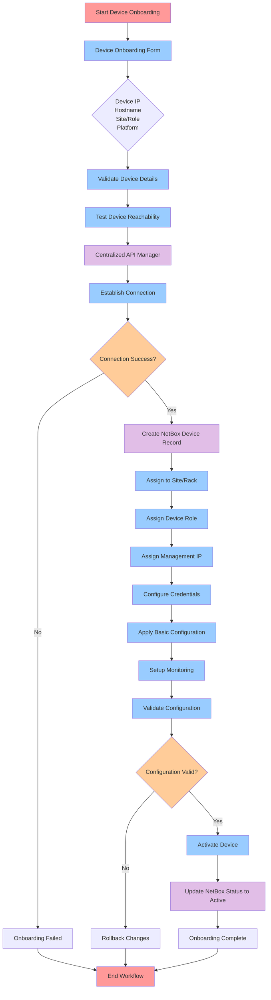
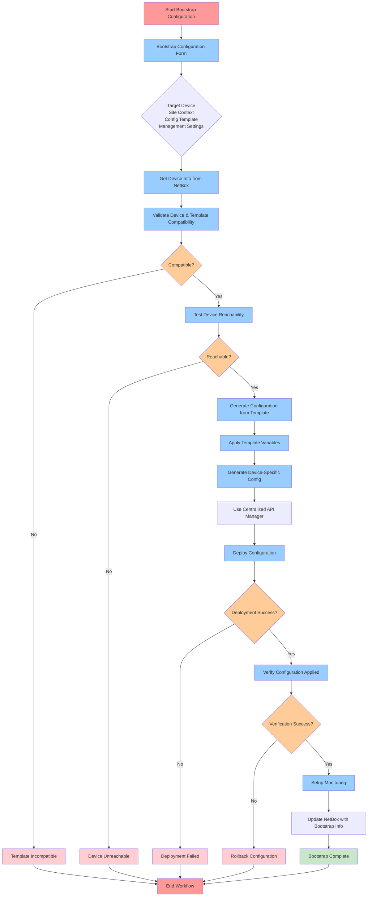
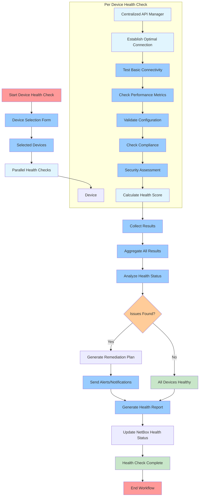
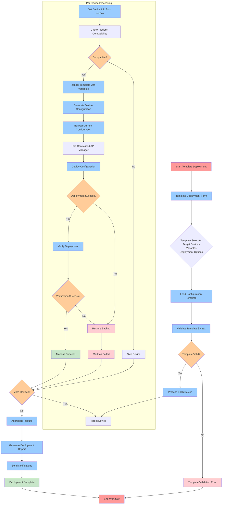

# Device Lifecycle Management Workflows

## Overview
This document contains flow diagrams for all device lifecycle management workflows including discovery, onboarding, bootstrap configuration, health checks, and configuration template deployment.

## 1. Device Discovery Workflow

## 2. Device Onboarding Workflow

## 3. Bootstrap Configuration Workflow

## 4. Device Health Check Workflow

## 5. Configuration Template Deployment Workflow

## Integration Points

### NetBox Integration
- Device information retrieval
- IP address resolution
- Platform detection
- Site and role information
- Status updates

### Centralized API Management
- Optimal connection method selection
- Multi-vendor platform support
- Automatic fallback mechanisms
- Connection pooling and optimization

### Configuration Management
- Template-based configuration generation
- Variable substitution
- Platform-specific rendering
- Backup and rollback capabilities

### Monitoring Integration
- Health status updates
- Performance metrics collection
- Alert generation
- Status reporting
