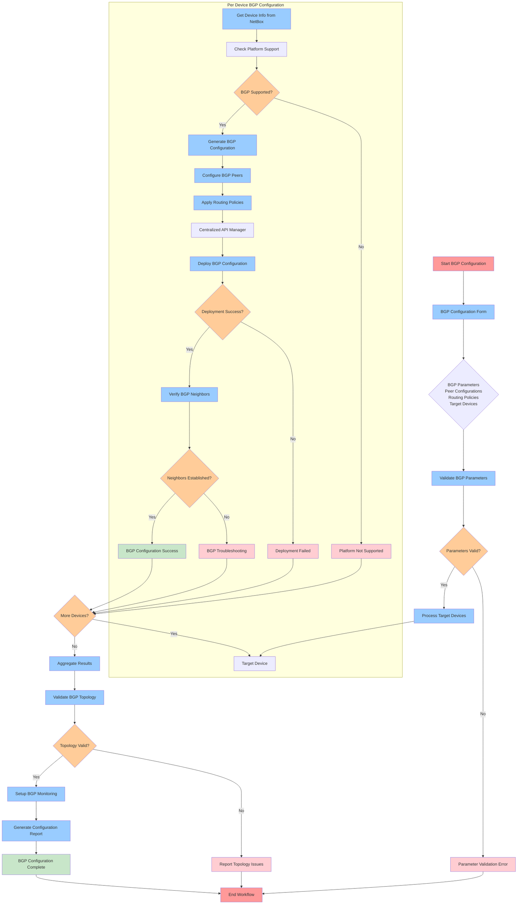
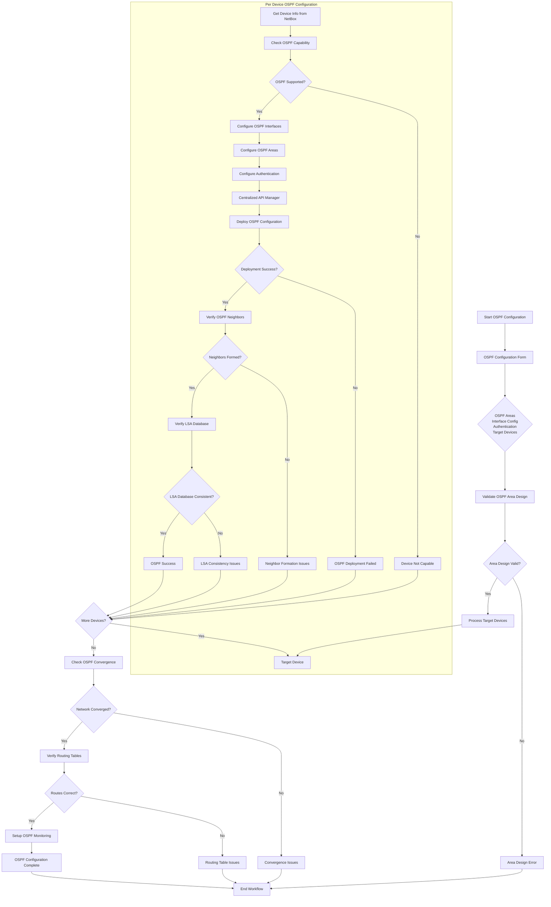
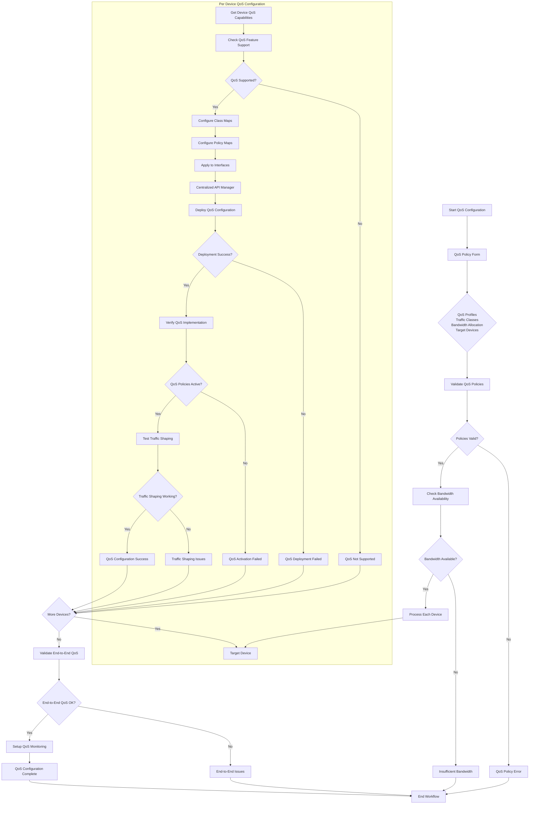
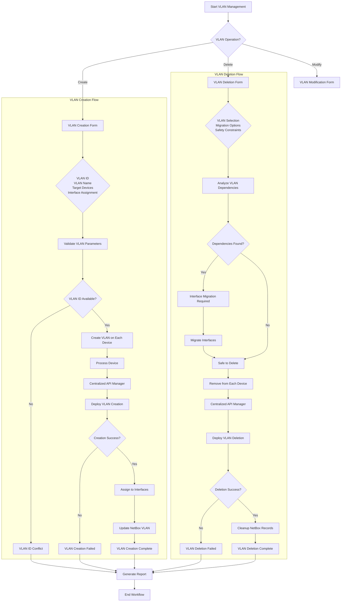
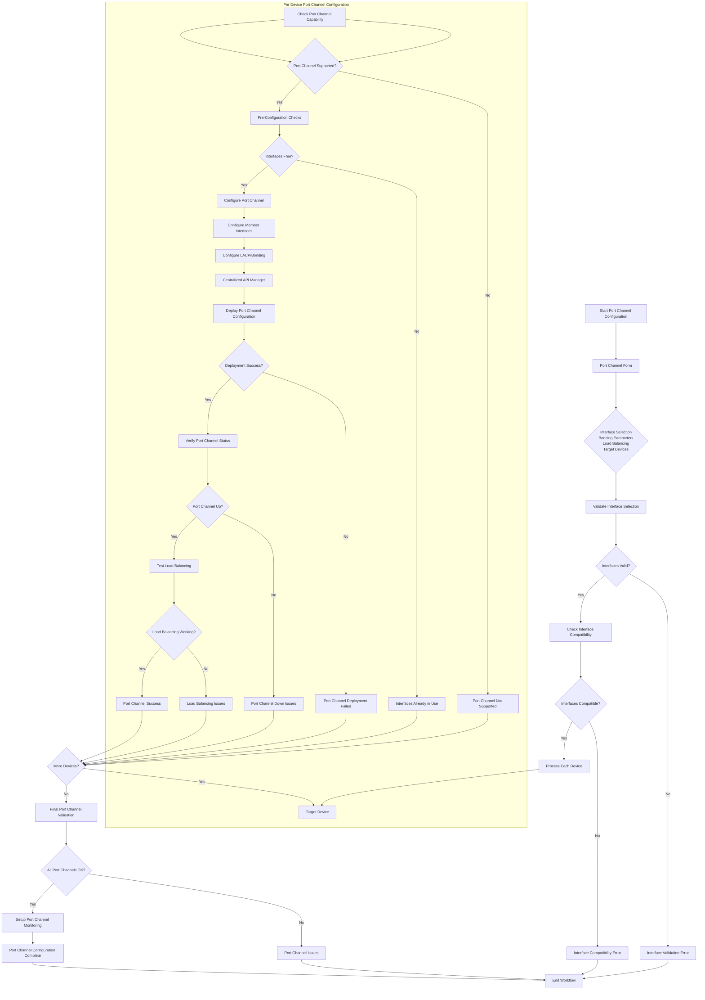

# Network Configuration Workflows

## Overview
Flow diagrams for network configuration workflows including BGP, OSPF, QoS, VLAN management, and port channel configuration.

## 1. BGP Configuration Workflow

## 2. OSPF Configuration Workflow

## 3. QoS Policy Configuration Workflow

## 4. VLAN Management Workflow

## 5. Port Channel Configuration Workflow

## Integration Patterns

### Common Integration Points
1. **Centralized API Manager**: All workflows use the centralized API management for optimal device connectivity
2. **NetBox Integration**: Device information, IP resolution, and status updates
3. **Configuration Validation**: Pre and post-deployment validation
4. **Error Handling**: Comprehensive error handling with rollback capabilities
5. **Monitoring Setup**: Automatic monitoring configuration for deployed features
6. **Concurrent Operations**: Parallel processing for multiple devices
7. **Platform Awareness**: Device platform-specific configuration generation

### Workflow Orchestration Features
- Form-based parameter collection
- Input validation and compatibility checking
- Device capability verification
- Configuration backup before changes
- Rollback mechanisms on failure
- Comprehensive reporting
- Status updates to NetBox
- Monitoring integration
