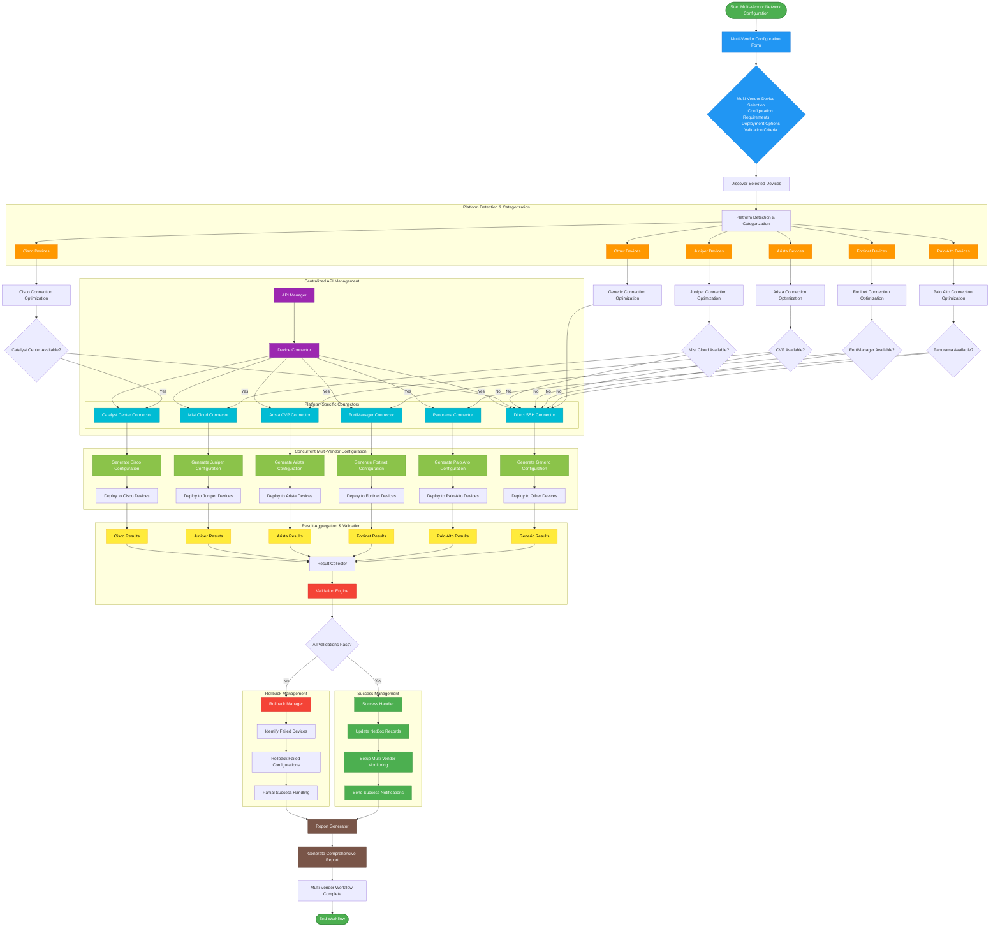
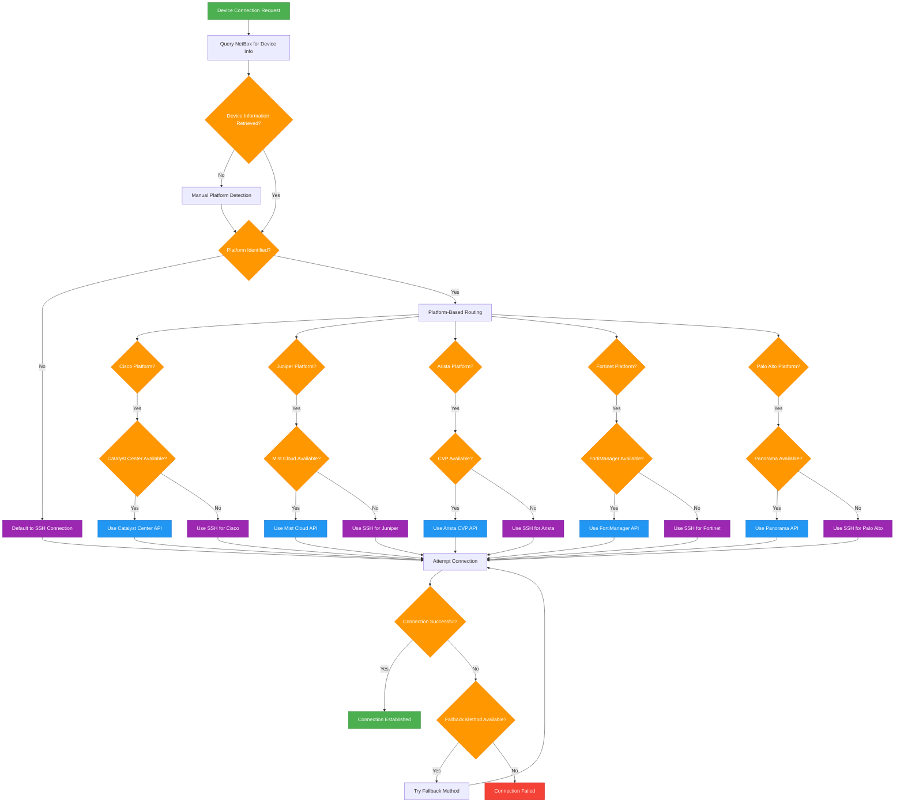
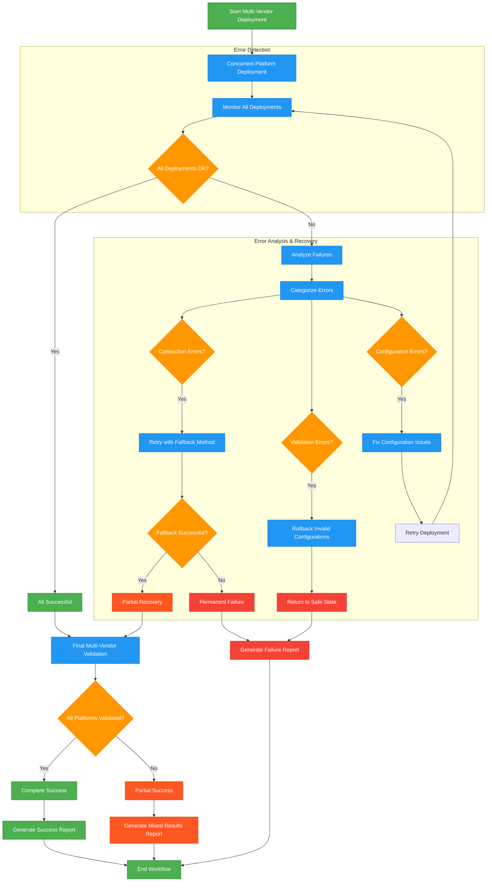

# Multi-Vendor Network Operations Workflow

## Overview
This document contains the comprehensive flow diagram for the multi-vendor network configuration workflow that demonstrates the full capabilities of the centralized API management system.

## Multi-Vendor Network Configuration Workflow

## Connection Method Selection Logic

## Concurrent Deployment Pattern

```mermaid
gantt
    title Multi-Vendor Concurrent Deployment Timeline
    dateFormat X
    axisFormat %s
    
    section Cisco Devices
    Platform Detection    :cisco-detect, 0, 2s
    Config Generation     :cisco-config, after cisco-detect, 3s
    API Deployment        :cisco-deploy, after cisco-config, 5s
    Validation           :cisco-validate, after cisco-deploy, 2s
    
    section Juniper Devices
    Platform Detection    :juniper-detect, 0, 2s
    Config Generation     :juniper-config, after juniper-detect, 3s
    API Deployment        :juniper-deploy, after juniper-config, 4s
    Validation           :juniper-validate, after juniper-deploy, 2s
    
    section Arista Devices
    Platform Detection    :arista-detect, 0, 2s
    Config Generation     :arista-config, after arista-detect, 2s
    API Deployment        :arista-deploy, after arista-config, 3s
    Validation           :arista-validate, after arista-deploy, 2s
    
    section Fortinet Devices
    Platform Detection    :fortinet-detect, 0, 2s
    Config Generation     :fortinet-config, after fortinet-detect, 3s
    API Deployment        :fortinet-deploy, after fortinet-config, 4s
    Validation           :fortinet-validate, after fortinet-deploy, 2s
    
    section Aggregation
    Result Collection     :collect, 12, 2s
    Final Validation      :final-validate, after collect, 3s
    Reporting            :report, after final-validate, 2s
```

## Error Handling and Fallback Strategy

## Key Features Demonstrated

### 1. Platform Intelligence
- Automatic device platform detection
- Optimal API method selection
- Fallback to SSH when APIs unavailable

### 2. Concurrent Operations
- Parallel deployment across multiple vendors
- Async processing for improved performance
- Independent error handling per platform

### 3. Centralized Management
- Single API manager for all platforms
- Unified connection handling
- Consistent error handling patterns

### 4. NetBox Integration
- Dynamic IP resolution
- Device platform information
- Automatic status updates

### 5. Comprehensive Validation
- Pre-deployment validation
- Post-deployment verification
- Multi-vendor consistency checks

### 6. Error Recovery
- Automatic fallback mechanisms
- Rollback capabilities
- Partial success handling

This workflow demonstrates the full power of the centralized API management system, showcasing how different network platforms can be managed through a single, unified interface while maintaining platform-specific optimizations and error handling.
